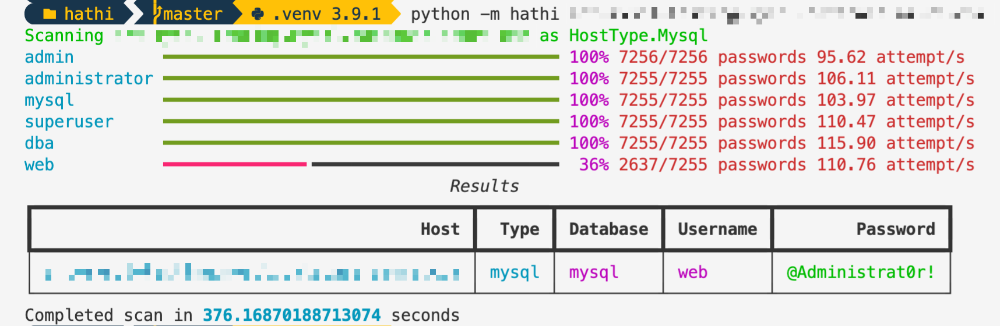

# Hathi

[](https://badge.fury.io/py/hathi)

A SQL host scanner and dictionary attack tool. Comes with a script (`filter_pass.py`) to filter a series of password lists based on password strength.



## Installation

Install using PyPI to install the Postgres driver

```console
pip install hathi
```

For the optional MSSQL support, install

```console
pip install "hathi[mssql]"
```

For the optional MySQL support, install

```console
pip install "hathi[mysql]"
```

## Usage

```default
usage: hathi [-h] [--username USERNAME [USERNAME ...]] [--range RANGE [RANGE ...]] [--usernames FILE] [--passwords FILE] [--hostname HOSTNAME]
                   [--json] [--mssql] [--postgres] [--mysql] [--multiple]
                   [host ...]

Port scan and dictionary attack PostgreSQL, MSSQL and MySQL servers.

positional arguments:
  host                  host to scan

optional arguments:
  -h, --help            show this help message and exit
  --username USERNAME [USERNAME ...]
                        specific username
  --range RANGE [RANGE ...]
                        CIDR range, e.g. 192.168.1.0/24
  --usernames FILE      Path to plaintext username list file
  --passwords FILE      Path to plaintext password list file
  --hostname HOSTNAME   an @hostname to append to the usernames
  --json                Output in JSON
  --mssql               Force scanning hosts as MSSQL
  --postgres            Force scanning hosts as Postgres
  --mysql               Force scanning hosts as Mysql
  --multiple            Seek multiple username/password pairs on a single host
```

Use a wordlist generator like [this one](https://github.com/zzztor/intelligence-wordlist-generator) or [this one](https://github.com/sc0tfree/mentalist) to create more effective password lists.
